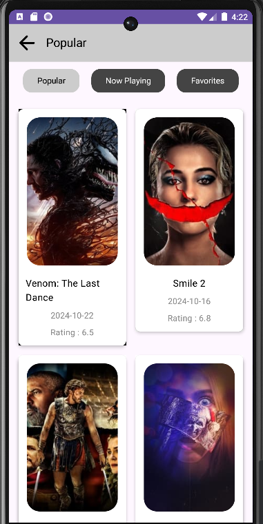
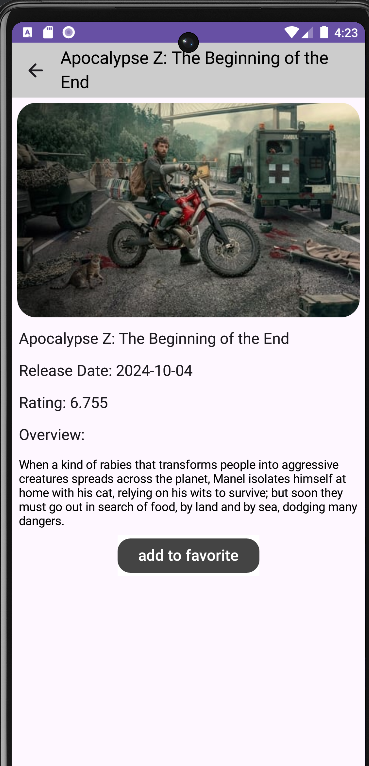

# 🎥 Movie App

This Kotlin Android application utilizes the TMDb API to display information about movies. <br>
Users can browse popular movies, and view detailed information about each movie.

---

## 🚀 Features

- **Browse Movies**: Discover popular and now playing movies.
- **Detailed Movie Info**: View details such as:
    - Title
    - Release Date
    - Rating
    - Overview
- **User-Friendly UI**: Designed with Jetpack Compose for a modern and intuitive user experience.

---

## 🛠️ Technologies & Tools

- **Language**: [Kotlin](https://kotlinlang.org/)
- **Framework**: [Jetpack Compose](https://developer.android.com/jetpack/compose)
- **API**: [The Movie Database (TMDb) API](https://developers.themoviedb.org/)
- **Architecture**: MVVM (Model-View-ViewModel)
- **Dependencies**:
    - Retrofit for API calls
    - Coroutines for asynchronous operations
    - Coil for image loading
    - Navigation Component for seamless screen transitions

---

## 📷 Screenshots

<br><br>

<br><br>

---

## ⚙️ Installation & Usage

1. Clone the repository:
   ```bash
   git clone https://github.com/roywasker/Movie-App.git
   ```
2. Open the project in [Android Studio](https://developer.android.com/studio).
3. Build and run the app on an emulator or physical device.